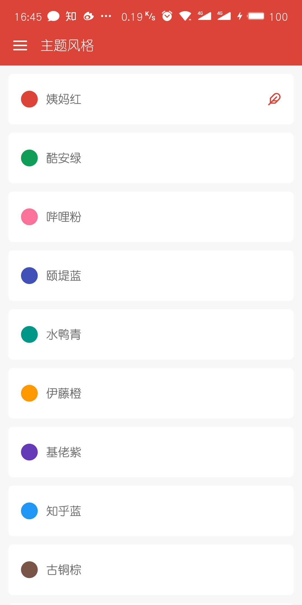

# DYTT

电影天堂RN客户端V2.0

重新开始！

## 重新开始

两年前发布了第一个版本。

现在，

使用最新的`react-native 0.57`和全新的设计完成了V2.0

## 目录

* [免责声明](#免责声明)
* [为什么要重新开始呢](#为什么要重新开始呢)
* [特色](#特色)
* [项目依赖](#项目依赖)
* [安装](#安装)
* [下载](#下载)
* [相关截图](#相关截图)
* [更新记录](#更新记录)
* [还未完成的还接下来要做的](#还未完成的还接下来要做的)
* [联系方式](#联系方式)
* [打赏](#打赏)

## 免责声明

本项目仅供学习交流使用，不得用于其他商业行为，数据来源于第三方网站，与本人无关

## 为什么要重新开始呢

有很多小伙伴发邮件问我为什么之前的项目运行不起来。

其实这个是我自己的原因，之前做的时候没什么经验，很多时候就直接修改了第三方库，所以就运行不起来了

还有就是第三方`api`也做了很大的变动

`react-native`和其他第三方库都更新了许多，正好重新开始，把一些新特性都利用起来（比如`context`），完整的来做一个项目，这比单纯的学习看文章要有效的多

正常的app本来就是需要长期维护更新的，只不过由于是个人项目，很多时候完成一个阶段就会因为各种原因而被耽搁，精力有限实属无奈

## 特色

大概是全网个人影视类项目最漂亮、体验最好的了吧（下方有截图~）。

最为一名偏体验偏设计的前端开发者，对界面和用户体验都有极高的重视。

（见过很多类似的，功能算是出来了，但是界面一看就是程序员风格）

[演示视频](https://web.codelabo.cn/demo/dytt.mp4)


## 项目依赖

依赖项不多，大部分都是用原生自带组件完成

```json
{
  "name": "DYTT",
  "version": "2.0.0",
  "private": true,
  "scripts": {
    "start": "node node_modules/react-native/local-cli/cli.js start",
    "test": "jest"
  },
  "dependencies": {
    "react": "16.6.1",
    "react-native": "0.57.5",
    "react-native-gesture-handler": "^1.0.9",
    "react-native-scrollviewpager": "^1.0.3",
    "react-native-splash-screen": "^3.1.1",
    "react-native-swiper": "^1.5.14",
    "react-native-vector-icons": "^6.1.0",
    "react-native-video": "^4.0.1",
    "react-navigation": "^3.0.0"
  },
  "devDependencies": {
    "babel-jest": "23.6.0",
    "jest": "23.6.0",
    "metro-react-native-babel-preset": "0.49.2",
    "react-test-renderer": "16.6.1"
  },
  "jest": {
    "preset": "react-native"
  }
}
```

## 安装

github [项目地址](https://github.com/XboxYan/DYTT)

本项目适用于相关技术人员学习交流，请自行编译安装

```sh
git clone https://github.com/XboxYan/DYTT.git

cd DYTT

yarn

react-native run-android
```

## 下载

~~目前只有安卓版本下载，需要`ios`的可以自行编译安装~~

~~下载链接~~

~~二维码~~

~~（微信扫码可能不支持，建议用其他扫描工具或者直接用浏览器打开上面链接）~~

考虑到安全问题，暂不提供安装包，可通过上述方式安装，或者与我联系提供安装包

## 相关截图

安卓

### 欢迎页


### 首页


### 功能菜单


### 历史记录


### 收藏


### 主题颜色



### 搜索


### 搜索结果


### 影片筛选


### 影片详情


### 影片播放


## 更新记录

记录一些页面的关键点

### 20181123

使用`react-navigation`作为导航

`/App.js`

由于新版导航用到了原生手势库，所以需要

```sh
yarn add react-native-gesture-handler

react-native link react-native-gesture-handler
```

整体导航结构如下

```js
const Drawer = createDrawerNavigator({
	Index: Index,
	History: History,
	Follow: Follow,
	Theme: Theme,
},DrawerNavigatorConfig);

const App = createAppContainer(createStackNavigator({
	Drawer: Drawer,
	Search: Search,
	MovieContent: MovieContent,
	MovieDetail: MovieDetail,
	Comment: Comment,
}, StackNavigatorConfig));
```

tab切换使用的是本人封装导航器`react-native-scrollviewpager`

[https://github.com/XboxYan/react-native-scrollviewpager](https://github.com/XboxYan/react-native-scrollviewpager)

有兴趣的可以给个star

使用方式比较简单

```sh
yarn add react-native-scrollviewpager
```

```js

import Scrollviewpager from 'react-native-scrollviewpager';

const tabBarOptions = (themeColor) => ({
    style:{
        paddingHorizontal:10,
        height:40,
        backgroundColor:'#fff'
    },
    labelStyle:{
        color:'#666'
    },
    activeTintColor:themeColor,
    indicatorStyle:{
        width:20,
        borderRadius:4,
        height:3,
        backgroundColor:themeColor,
        bottom:2
    }
})

//
<Scrollviewpager tabBarOptions={tabBarOptions(themeColor)} >
    <Text tablabel="首页">111</Text>
    <Text tablabel="电影">111</Text>
    <Text tablabel="动漫">111</Text>
</Scrollviewpager> 
//
```

### 20181125

使用`context`管理全局数据

`/util/store.js`

历史记录，收藏，~~主题（废弃，下面有其他方式实现）~~

```js
export const Store = createContext(initialStore);

<Store.Provider value={{
    ...initialStore
}}>
    {this.props.children}
</Store.Provider>
```

### 20181127

影视详情页面

`./src/page/MovieDetail.js`

头部滚动跟随效果使用`Animated.ScrollView`实现

```js
scrollTop = new Animated.Value(0);

//...
<Animated.ScrollView
    scrollEventThrottle={1}
    onScroll={Animated.event(
        [{ nativeEvent: { contentOffset: { y: this.scrollTop } } }],
        { useNativeDriver: true }
    )}
>
</Animated.ScrollView>
//...

```

视频播放器自定义外观

`./src/components/Video.js`

使用开源播放器`react-native-video`

[https://github.com/react-native-community/react-native-video](https://github.com/react-native-community/react-native-video)

这里有一个`bug`

`source={{uri:uri}}`，`uri`不能为空字符串，否则切换资源部生效

支持手势快进快退，自动隐藏播放栏

* 还未完成的功能

全屏切换


### 20181203

主题颜色

`./App.js`、`./src/page/Theme.js`

`react-navigation`内置属性`screenProps`，其原理仍然使用的`context`特性

```jsx
<App screenProps={{themeColor:themeColor, setTheme:this.setTheme}} />
```

调用方式

```js
const {navigation,screenProps:{themeColor}} = this.props;
```
### 20181204

历史记录

`./src/page/History.js`

通过`context`传递数据，需设置`contextType`

```js
import { Store } from '../../util/store';
export default class History extends PureComponent {
    render() {
        const { historyList } = this.context;
        return (
            //...
        )
    }
}
History.contextType = Store;
```

### 20181205

收藏页面

`./src/page/Follow.js`

与'历史记录'基本一致

### 20181206

本地存储

`./util/storage.js`

使用原生`AsyncStorage`

```js
class Storage {
    /**
     * 获取
     */

    static get = async (key) => {
        try {
            const value = await AsyncStorage.getItem(key);
            if (value !== null) {
                // We have data!!
                return JSON.parse(value)
            } else {
                return false
            }
        } catch (error) {
            return false
        }
    }

    /**
     * 保存
     */
    static save = async (key, value) => {
        try {
            await AsyncStorage.setItem(key, JSON.stringify(value));
            return true
        } catch (error) {
            // Error saving data
            return false
        }
    }
}

export default Storage;
```

### 20181209

搜索

`./src/page/Search.js`

### 20181211

影片筛选

`./src/page/MovieContent.js`

使用侧边导航栏，调用方式与原生`DrawerLayoutAndroid`一致

```js
import DrawerLayout from 'react-native-gesture-handler/DrawerLayout';
```

### 20181214

图标，启动图

使用开源库`react-native-splash-screen`

[https://github.com/crazycodeboy/react-native-splash-screen#readme](https://github.com/crazycodeboy/react-native-splash-screen#readme)

如果需要白底深色的状态栏文字

```xml
<style name="SplashScreenTheme" parent="SplashScreen_SplashTheme">
    <item name="android:windowIsTranslucent">true</item>
    <item name="colorPrimaryDark">@color/status_bar_color</item>
    <item name="android:windowLightStatusBar">true</item><!--加上这一句-->
</style>
```

2.0 基本完成

### 20181217

安卓打包

`./android/build.gradle`

修改一下配置

注释`jcenter()`，添加

```groovy
maven{ url 'http://maven.aliyun.com/nexus/content/groups/public/'}
maven{ url 'https://jitpack.io' }
```

不然会卡在下载阶段

```groovy
...
allprojects {
    repositories {
        mavenLocal()
        google()
        //jcenter()
        //更换国内镜像
        maven{ url 'http://maven.aliyun.com/nexus/content/groups/public/'}
        maven{ url 'https://jitpack.io' }
        maven {
            // All of React Native (JS, Obj-C sources, Android binaries) is installed from npm
            url "$rootDir/../node_modules/react-native/android"
        }
    }
}
...

```

常用命令
```sh
# 卸载安装包
adb uninstall com.packgeName

# 生成Release包
gradlew assembleRelease

# 安装Release包
gradlew installRelease
```

> 注意：在 debug 和 release 版本间来回切换安装时可能会报错签名不匹配，此时需要先卸载前一个版本再尝试安装。
> 可通过 adb uninstall com.packgeName 方式来卸载，直接通过长按桌面图标有可能卸载不干净

### 20181219

更换数据解析

使用`cheerio`对`html`页面进行本地解析（爬虫）

注意，一定是要 `v0.22.0`，是因为之后的版本，`cheerio` 引入了 `parse5`，而 `parse5` 依赖 `stream.Writable`，`npm` 安装的 `stream` 并不提供。

```sh
yarn add cheerio@0.22.0
```

`cheerio` 的依赖 `htmlparser2` 依赖一些 `node` 内置的库。不过这是可以被解决的，理论上，只要这些依赖库不依赖更底层的接口，那么就可以通过 `npm` 安装上这些依赖：

```sh
yarn add events stream buffer
```

使用方式

```js
import cheerio from 'cheerio';
const $ = cheerio.load('<h2 class="title">Hello world</h2>');
console.log($('h2').text()) //Hello world
```

### 20181220

完成影视列表、影视详情数据解析

*注意*

1. `cheerio`在使用`map`方法时，需要用`get`来获取数组，这点和`react`不同

2. 参数和`jquery`相同，分别是 **序列（`i`）**、**每一项（`el`）**，这和`js`的`map`参数是相反的

```js
$('li').map((i, el)=>{
    return ({
        "ID": i,
        //...
    })
}).get()//需要用get获取
```

### 20181221

完成首页数据解析，`API`解析更换完成，速度相比之前更快（缺点是更耗费流量，毕竟是下载整个网页~😄）

*注意*

`cheerio`的`next`方法只能获取到下一个相邻元素，如果想获取后面所有兄弟元素，需要使用`nextAll`

### 20181224

完成全屏模式

使用第三方库 `react-native-orientation`

## 还未完成的还接下来要做的

* ~~视频播放做全屏切换~~
* 没有适配`ios`，不过代码中没有使用安卓专有的库，理论上可以直接运行（可能有少部分需要适配），有兴趣的小伙伴可以`fork`下来自己适配一下
* 会新增设置选项，进行网络设置，播放设置等（会参考其他视频软件的功能）
* 目前历史记录和收藏均保存在本地，意味着如果卸载app将导致数据丢失，如果可能的话，将来把数据保存在自己的服务器上
* `react-navigation`在页面切换时略微卡顿，还有一个`react-native-navigation`，如果可能的话，可以用来替代`react-navigation`
* ~~目前在网上找的`api`可能不够理想~~（已采用本地爬虫方式），如果谁有更好的设计和更好的`api`可以参考一下~如果有提供后台服务的就更好了
* `react-native`确实性能略显不足，特别是长列表的情况，准备学习`flutter`，一种新的渲染方式（可以和web中的`canvas`类比）

## 联系方式

有什么问题可以与我联系

yanwenbin1991@live.com

或者直接提 `issue`

## 打赏

精神支撑一下，给个 star 呗

如果体验觉得还不错的话，大佬们可以随意打赏，金额不限

微信


支付宝

