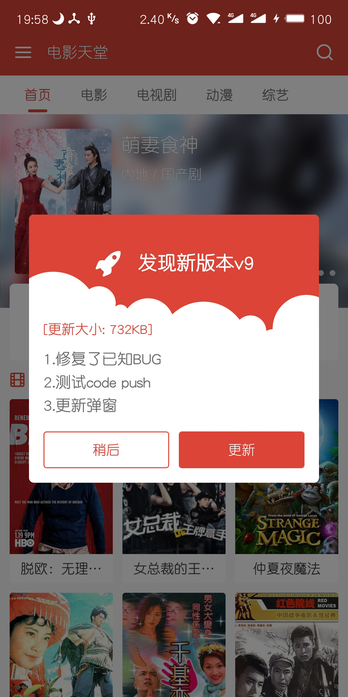
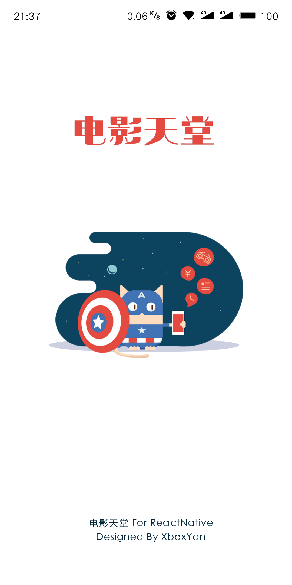
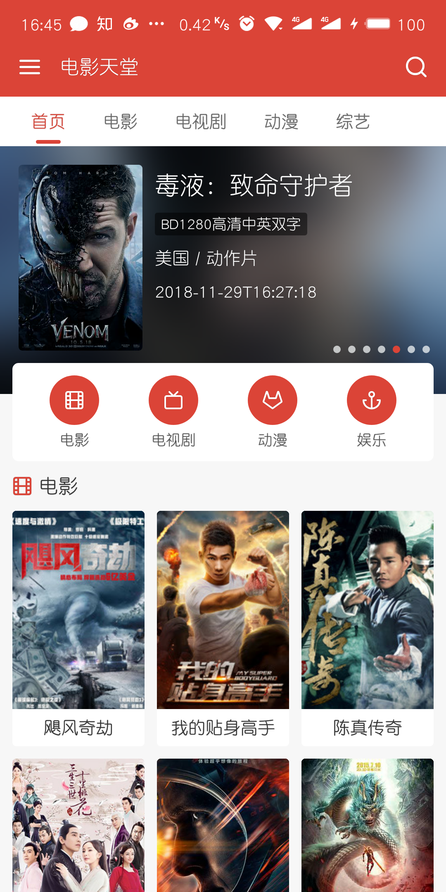
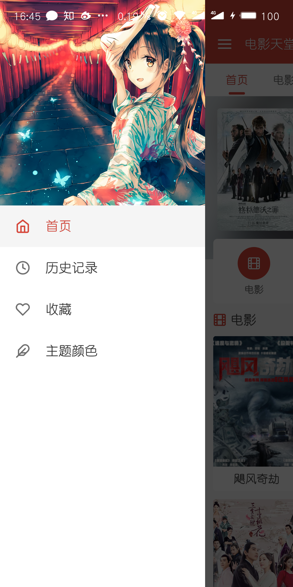
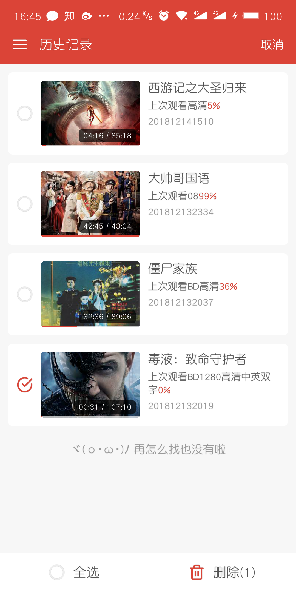
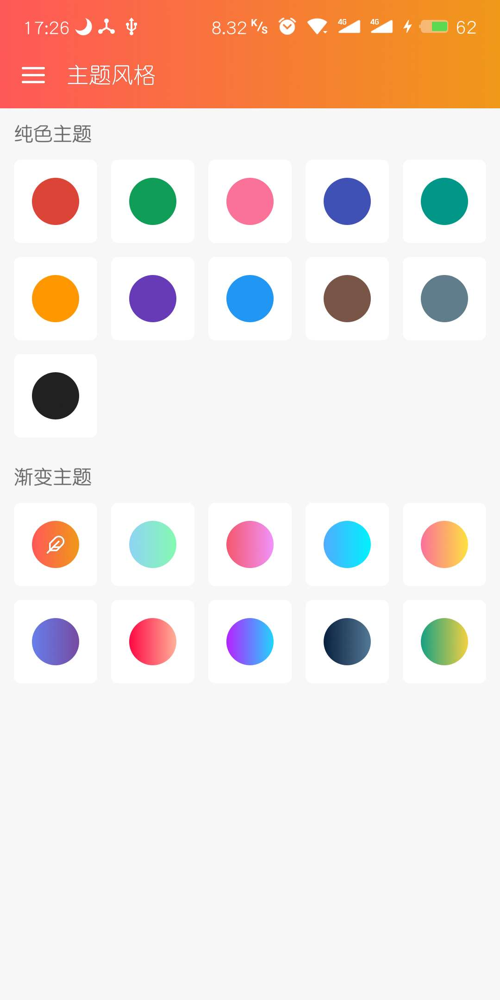
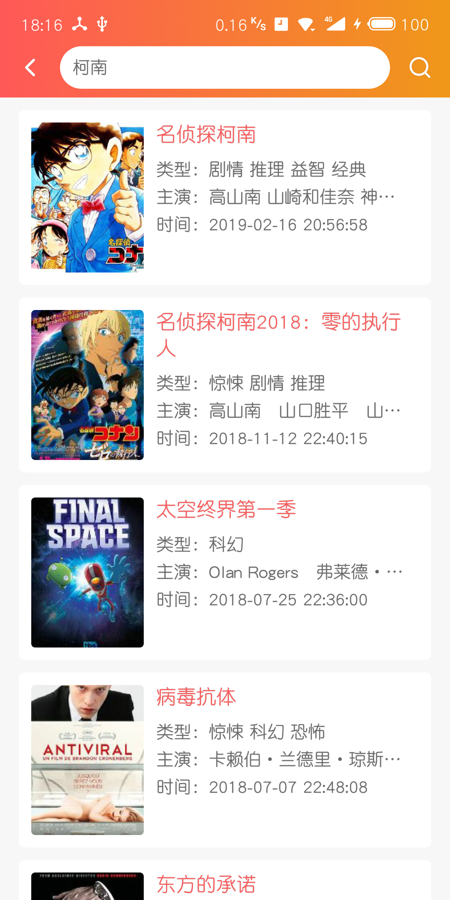
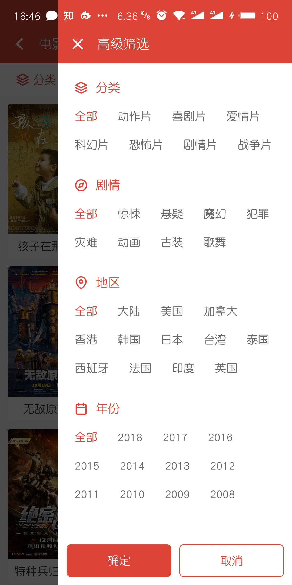
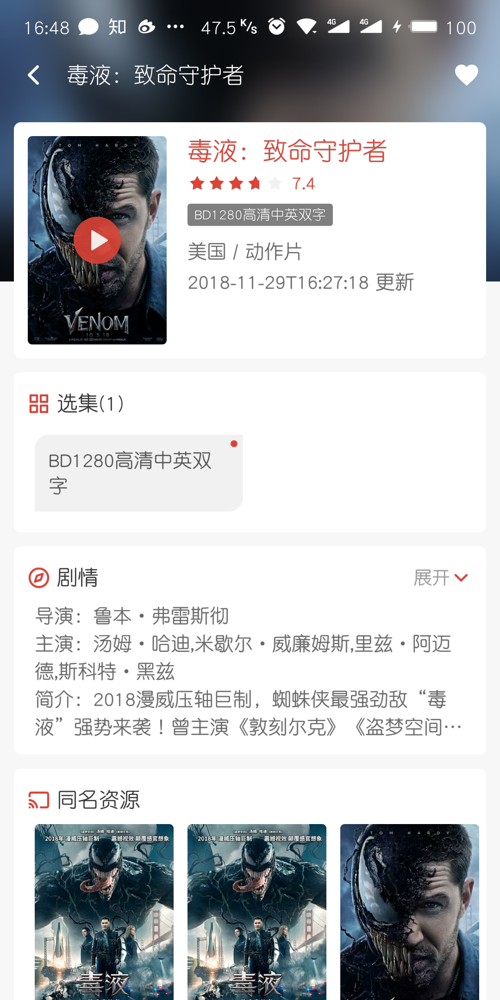
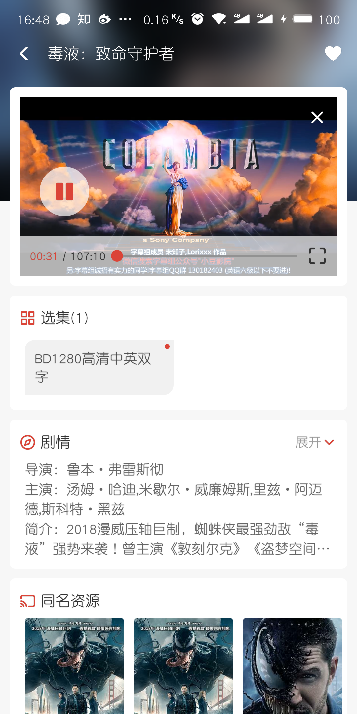

# DYTT


<a href="https://github.com/XboxYan/DYTT/releases"></a>
<a href="https://github.com/XboxYan/DYTT/stargazers"></a>
<a href="https://github.com/XboxYan/DYTT/network/members"></a>
<a href="https://github.com/XboxYan/DYTT/releases"></a>

第三方电影天堂React Native客户端V2.0

### [更新记录](./update.md)

## 公告

~~😢很抱歉，该项目的数据来源网站停止运行了，详细数据源可参考`api.js`，应该是受到了打击盗版网站的影响。~~

~~不过业务逻辑对于`react native`学习交流没什么问题，如果有合适的接口数据我会尽快适配。~~

😄已完成数据源更新解析，现在请求一切正常。

## 目录

* [免责声明](#免责声明)
* [缘由](#缘由)
* [特色](#特色)
* [项目依赖](#项目依赖)
* [安装](#安装)
* [下载](#下载)
* [相关截图](#相关截图)
* [还未完成的还接下来要做的](#还未完成的还接下来要做的)
* [联系方式](#联系方式)
* [打赏](#打赏)

## 免责声明

**本项目仅供学习交流使用，不得用于其他商业行为，数据来源于第三方网站，与本人无关！**

重点是交流讨论`react native`技术，而不是资源为什么不全，因为这是第三方的，我也没有上服务器，纯本地解析。

## 缘由

有很多小伙伴发邮件问我为什么之前的项目运行不起来。

其实这个是我自己的原因，之前做的时候没什么经验，很多时候就直接修改了第三方库，所以就运行不起来了

还有就是第三方`api`也做了很大的变动

`react-native`和其他第三方库都更新了许多，正好重新开始，把一些新特性都利用起来（比如`context`），完整的来做一个项目，这比单纯的学习看文章要有效的多

正常的app本来就是需要长期维护更新的，只不过由于是个人项目，很多时候完成一个阶段就会因为各种原因而被耽搁，精力有限实属无奈

## 特色

大概是全网个人影视类项目最漂亮、体验最好的了吧（下方有[截图](#相关截图)~）。

做为一名偏体验偏设计的前端开发者，对界面和用户体验都有极高的重视。

[演示视频](https://web.codelabo.cn/demo/dytt.mp4)

（见过很多类似的第三方应用，功能算是出来了，但是界面一看就是程序员风格，不忍直视，毕竟一般都是做后台的才会做这些，天生就对UI和体验没什么感觉）


## 安装

github [项目地址](https://github.com/XboxYan/DYTT)

本项目适用于相关技术人员学习交流，请自行编译安装

```sh
git clone https://github.com/XboxYan/DYTT.git

cd DYTT

yarn

react-native run-android
```

## 下载

~~目前只有安卓版本下载，需要`ios`的可以自行编译安装~~

~~下载链接~~

~~二维码~~

~~（微信扫码可能不支持，建议用其他扫描工具或者直接用浏览器打开上面链接）~~

~~考虑到安全问题，暂不提供安装包~~，可通过上述方式安装，或者与我联系提供安装包

[dytt.apk](https://github.com/XboxYan/DYTT/releases/download/v2.2/app-armeabi-v7a-release.apk)

`android`下载解压安装。`ios`自行编译安装。

安装包可能更新不及时，建议自行编译安装。

> 一般功能可通过热更新直接更新，无需重新更新安装包。

## 相关截图

安卓

### 更新提示



### 欢迎页



### 首页



### 功能菜单



### 历史记录



### 收藏


### 主题颜色



### 搜索


### 搜索结果



### 影片筛选



### 影片详情



### 影片播放



## 还未完成的还接下来要做的

* ~~视频播放做全屏切换~~（已完成）
* 没有适配`ios`，不过代码中没有使用安卓专有的库，理论上可以直接运行（可能有少部分需要适配），有兴趣的小伙伴可以`fork`下来自己适配一下
* ~~会新增设置选项，进行网络设置，播放设置等（会参考其他视频软件的功能）~~（已完成）
* 目前历史记录和收藏均保存在本地，意味着如果卸载app将导致数据丢失，如果可能的话，将来把数据保存在自己的服务器上
* `react-navigation`在页面切换时略微卡顿，还有一个`react-native-navigation`，如果可能的话，可以用来替代`react-navigation`
* ~~目前在网上找的`api`可能不够理想~~（已采用本地爬虫方式），如果谁有更好的设计和更好的`api`可以参考一下~如果有提供后台服务的就更好了
* `react-native`确实性能略显不足，特别是长列表的情况，准备学习`flutter`，一种新的渲染方式（可以和web中的`canvas`类比）
* ~~热更新功能~~（已完成）

## 联系方式

有什么问题可以与我联系

yanwenbin1991@live.com

或者直接提 `issue`

新建立了一个qq群，欢迎交流。


## 打赏

精神支撑一下，给个 star 

如果体验觉得还不错的话，大佬们可以随意打赏，金额不限


