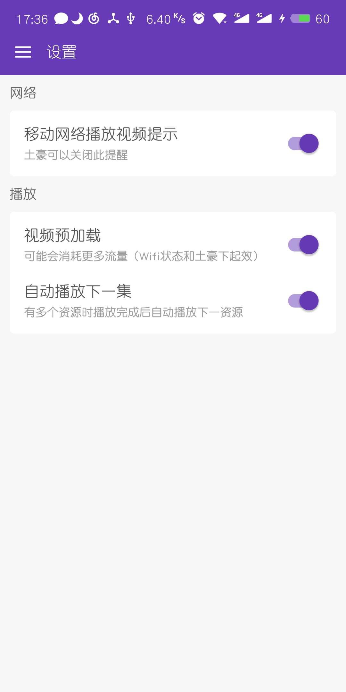

# 更新记录

记录一些页面的关键点

### 20191225

更换`API`，原网站因为`SSL`证书问题暂不可用
修复搜索问题

### 20191012

修复首页和搜索页图片的链接问题

### 20190226

修复强制更新时弹窗的UI问题。

### 20190218

已完成新数据源解析。

更换搜索列表布局。（搜索支持影片名，演员搜索）


版本号为`2.2.0`

### 20190216

由于源数据网站已停止运行，现寻找一个可替代方案。

[www.kankanwu.com](https://www.kankanwu.com)

目前已完成首页数据解析。

### 20190117

主题重新设计，新增线性渐变主题

采用[https://github.com/react-native-community/react-native-linear-gradient](https://github.com/react-native-community/react-native-linear-gradient)

注意 `<LinearGradient colors={[color1,color2]} start={{x: 0, y: 0}} end={{x: 1, y: 0}} style={styles.appbar}>`

`colors` 必须为长度大于 `2` 的数组。


### 20190110

热更新完成

采用方案是[react-native-code-push](https://github.com/Microsoft/react-native-code-push)


常用命令

```shell
# 列出账号下的所有项目
code-push app list
# 列出应用的部署
code-push deployment ls dyttAndroid
# 列出应用的版本历史
code-push deployment history dyttAndroid Production
# 发布更新
code-push release-react dyttAndroid android --t 2.0.0 --dev false --d Production --des "1.修复了已知BUG\n 2.测试code push" --m true
```

code-push release-react dyttAndroid android --t 2.2.0 --dev false --d Production --des "修复搜索结果问题" --m true


### 20190104

完成设置的三个功能，分别是

* 移动网络播放视频提示
* 视频预加载
* 自动播放下一集


此时点击`继续播放`可暂时允许使用移动网络播放

网络变化监听使用原生`NetInfo`实现

```js
NetInfo.addEventListener('connectionChange',this.onNectivityChange);
```

### 20181229

现在更新采用倒序排序

新增'设置'页面，目前只更新了UI，功能还未实现

修复`API`解析错误（网站发生变动）

为侧边封面图增加了隐藏的历史记录入口，可直接进入到上次观看的影片



### 20181224

完成全屏模式

使用第三方库 `react-native-orientation`

`react-native-orientation`打包`release`版本时报错，感谢[`singcl`](https://github.com/singcl)提供的修改

[:bug: [bug fix] 修复react-native-orientation package 导致打包失败的问题 ](https://github.com/XboxYan/DYTT/pull/4)

### 20181221

完成首页数据解析，`API`解析更换完成，速度相比之前更快（缺点是更耗费流量，毕竟是下载整个网页~😄）

*注意*

`cheerio`的`next`方法只能获取到下一个相邻元素，如果想获取后面所有兄弟元素，需要使用`nextAll`

### 20181220

完成影视列表、影视详情数据解析

*注意*

1. `cheerio`在使用`map`方法时，需要用`get`来获取数组，这点和`react`不同

2. 参数和`jquery`相同，分别是 **序列（`i`）**、**每一项（`el`）**，这和`js`的`map`参数是相反的

```js
$('li').map((i, el)=>{
    return ({
        "ID": i,
        //...
    })
}).get()//需要用get获取
```

### 20181219

更换数据解析

使用`cheerio`对`html`页面进行本地解析（爬虫）

注意，一定是要 `v0.22.0`，是因为之后的版本，`cheerio` 引入了 `parse5`，而 `parse5` 依赖 `stream.Writable`，`npm` 安装的 `stream` 并不提供。

```sh
yarn add cheerio@0.22.0
```

`cheerio` 的依赖 `htmlparser2` 依赖一些 `node` 内置的库。不过这是可以被解决的，理论上，只要这些依赖库不依赖更底层的接口，那么就可以通过 `npm` 安装上这些依赖：

```sh
yarn add events stream buffer
```

使用方式

```js
import cheerio from 'cheerio';
const $ = cheerio.load('<h2 class="title">Hello world</h2>');
console.log($('h2').text()) //Hello world
```

### 20181217

安卓打包

`./android/build.gradle`

修改一下配置

注释`jcenter()`，添加

```groovy
maven{ url 'http://maven.aliyun.com/nexus/content/groups/public/'}
maven{ url 'https://jitpack.io' }
```

不然会卡在下载阶段

```groovy
...
allprojects {
    repositories {
        mavenLocal()
        google()
        //jcenter()
        //更换国内镜像
        maven{ url 'http://maven.aliyun.com/nexus/content/groups/public/'}
        maven{ url 'https://jitpack.io' }
        maven {
            // All of React Native (JS, Obj-C sources, Android binaries) is installed from npm
            url "$rootDir/../node_modules/react-native/android"
        }
    }
}
...

```

常用命令
```sh
# 卸载安装包
adb uninstall com.packgeName

# 生成Release包
gradlew assembleRelease

# 安装Release包
gradlew installRelease
```

> 注意：在 debug 和 release 版本间来回切换安装时可能会报错签名不匹配，此时需要先卸载前一个版本再尝试安装。
> 可通过 adb uninstall com.packgeName 方式来卸载，直接通过长按桌面图标有可能卸载不干净

### 20181214

图标，启动图

使用开源库`react-native-splash-screen`

[https://github.com/crazycodeboy/react-native-splash-screen#readme](https://github.com/crazycodeboy/react-native-splash-screen#readme)

如果需要白底深色的状态栏文字

```xml
<style name="SplashScreenTheme" parent="SplashScreen_SplashTheme">
    <item name="android:windowIsTranslucent">true</item>
    <item name="colorPrimaryDark">@color/status_bar_color</item>
    <item name="android:windowLightStatusBar">true</item><!--加上这一句-->
</style>
```

### 20181211

影片筛选

`./src/page/MovieContent.js`

使用侧边导航栏，调用方式与原生`DrawerLayoutAndroid`一致

```js
import DrawerLayout from 'react-native-gesture-handler/DrawerLayout';
```

2.0 基本完成

### 20181209

搜索

`./src/page/Search.js`

### 20181206

本地存储

`./util/storage.js`

使用原生`AsyncStorage`

```js
class Storage {
    /**
     * 获取
     */

    static get = async (key) => {
        try {
            const value = await AsyncStorage.getItem(key);
            if (value !== null) {
                // We have data!!
                return JSON.parse(value)
            } else {
                return false
            }
        } catch (error) {
            return false
        }
    }

    /**
     * 保存
     */
    static save = async (key, value) => {
        try {
            await AsyncStorage.setItem(key, JSON.stringify(value));
            return true
        } catch (error) {
            // Error saving data
            return false
        }
    }
}

export default Storage;
```

### 20181205

收藏页面

`./src/page/Follow.js`

与'历史记录'基本一致

### 20181204

历史记录

`./src/page/History.js`

通过`context`传递数据，需设置`contextType`

```js
import { Store } from '../../util/store';
export default class History extends PureComponent {
    render() {
        const { historyList } = this.context;
        return (
            //...
        )
    }
}
History.contextType = Store;
```

### 20181203

主题颜色

`./App.js`、`./src/page/Theme.js`

`react-navigation`内置属性`screenProps`，其原理仍然使用的`context`特性

```jsx
<App screenProps={{themeColor:themeColor, setTheme:this.setTheme}} />
```

调用方式

```js
const {navigation,screenProps:{themeColor}} = this.props;
```

### 20181127

影视详情页面

`./src/page/MovieDetail.js`

头部滚动跟随效果使用`Animated.ScrollView`实现

```js
scrollTop = new Animated.Value(0);

//...
<Animated.ScrollView
    scrollEventThrottle={1}
    onScroll={Animated.event(
        [{ nativeEvent: { contentOffset: { y: this.scrollTop } } }],
        { useNativeDriver: true }
    )}
>
</Animated.ScrollView>
//...

```

视频播放器自定义外观

`./src/components/Video.js`

使用开源播放器`react-native-video`

[https://github.com/react-native-community/react-native-video](https://github.com/react-native-community/react-native-video)

这里有一个`bug`

`source={{uri:uri}}`，`uri`不能为空字符串，否则切换资源部生效

支持手势快进快退，自动隐藏播放栏

* 还未完成的功能

~~全屏切换~~（已完成）

### 20181125

使用`context`管理全局数据

`/util/store.js`

历史记录，收藏，~~主题（废弃，下面有其他方式实现）~~

```js
export const Store = createContext(initialStore);

<Store.Provider value={{
    ...initialStore
}}>
    {this.props.children}
</Store.Provider>
```

### 20181123

使用`react-navigation`作为导航

`/App.js`

由于新版导航用到了原生手势库，所以需要

```sh
yarn add react-native-gesture-handler

react-native link react-native-gesture-handler
```

整体导航结构如下

```js
const Drawer = createDrawerNavigator({
	Index: Index,
	History: History,
	Follow: Follow,
	Theme: Theme,
},DrawerNavigatorConfig);

const App = createAppContainer(createStackNavigator({
	Drawer: Drawer,
	Search: Search,
	MovieContent: MovieContent,
	MovieDetail: MovieDetail,
	Comment: Comment,
}, StackNavigatorConfig));
```

tab切换使用的是本人封装导航器`react-native-scrollviewpager`

[https://github.com/XboxYan/react-native-scrollviewpager](https://github.com/XboxYan/react-native-scrollviewpager)

有兴趣的可以给个star

使用方式比较简单

```sh
yarn add react-native-scrollviewpager
```

```js

import Scrollviewpager from 'react-native-scrollviewpager';

const tabBarOptions = (themeColor) => ({
    style:{
        paddingHorizontal:10,
        height:40,
        backgroundColor:'#fff'
    },
    labelStyle:{
        color:'#666'
    },
    activeTintColor:themeColor,
    indicatorStyle:{
        width:20,
        borderRadius:4,
        height:3,
        backgroundColor:themeColor,
        bottom:2
    }
})

//
<Scrollviewpager tabBarOptions={tabBarOptions(themeColor)} >
    <Text tablabel="首页">111</Text>
    <Text tablabel="电影">111</Text>
    <Text tablabel="动漫">111</Text>
</Scrollviewpager> 
//
```